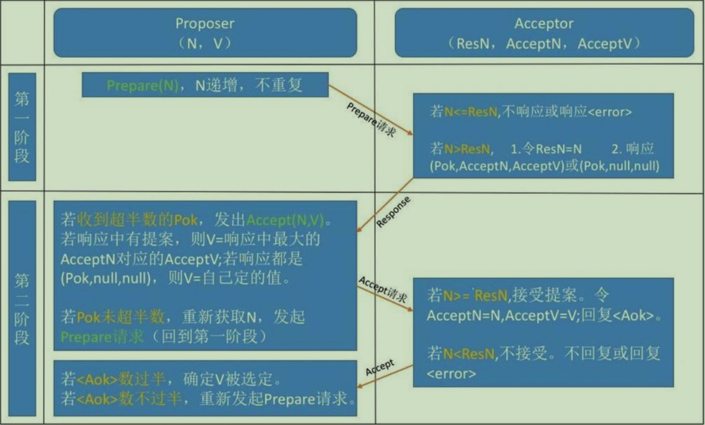

# 分布式原理

*互联网发展至今，为了应对更高的业务量、提供更优质的服务，后端从单体服务逐渐演进至当下主流的分布式架构。所谓分布式，通俗来说就是将一个大而全的服务，基于业务领域拆分为多个独立的子服务(低耦合、高内聚)，并针对每个子服务部署合适的实例，不通的实例在空间上是可以随意分布的。*

### 1、分布式理论

#### 1.1 一致性
- 强一致性
- 弱一致性
  - 读写一致性 
  - 单调读一致性
  - 因果一致性
  - 最终一致性

#### 1.2 CAP定理
- 一致性 Consistency
  - 在数据一致性抵达之前, 不对外提供服务
- 可用性 Availability
  - 在数据一致性抵达之前, 仍对外提供服务, 哪怕响应的为旧数据
- 分区容错性 Partition tolerance
  - 分区容错性 P 是分布式系统的前提, 因此只在CA之间做取舍, P 必须保留

#### 1.3 BASE理论
- 基本可用  BA - Basically Available
- 软状态    S - Soft state
- 最终一致性 E -  Eventually consistent

#### 1.4 分布式事务
- ACID 
  - A - Atomicity（原子性）
  - C - Consistency（一致性）
  - I - Isolation（隔离性）
  - D - Durablity（持久性）
- 分布式环境中多服务实例配合对外提供服务, 因此一次事务的提供涉及到多节点的读写操作, 跨节点操作无法基于数据库自身来满足ACID四大特性, 此时就需要分布式事务来实现跨节点操作操作事务

#### 1.5 一致性协议 - 2PC
- 两阶段提交(Two-Phase Commit)
  - 准备阶段(Prepare phase)
    - 事务管理器给每个参与者发送prepare请求, 每个参与者在本地执行事务但不提交(如: mysql写undo log和redo log, 但是不commit)
  - 提交阶段(Commit phase)
    - 事务管理器收到参与者执行失败或者超时的信息, 直接给参与者发送rollback命令; 否则发送commit命令。参与者在接受到此命令后执行并释放事务处理过程中的锁资源.
- 2PC的优缺点
  - 优点: 原理简单、实现方便
  - 缺点: 同步阻塞、单点问题、数据不一致、太过保守
    - 同步阻塞: 所有参与者在等待其他参与者的响应的过程中无法执行别的操作, 这种同步阻塞极大的限制了分布式系统的性能
    - 单点问题: 协调者在整个二阶段提交过程很重要, 如果协调者在提交阶段出现问题, 整个流程将无法运转。其他参与者在未收到commit或rollback时, 将处于一直锁定事务资源的状态中, 而无法继续完成事务操作。
    - 数据不一致: 如果协调者给所有参与者发送了commit, 由于局部网络异常或协调者在发送完所有的commit前自身崩溃, 导致最终只有部分参与者接到commit命令提交事务, 这将导致严重的数据不一致问题。
    - 太过于保守: 如果参与者在提交阶段, 由于网络故障或者自身问题导致不能及时给到协调者响应, 协调者只能依靠自身的超时机制来判断是否需要中断事务。显然此种策略相对较为保守。缺乏较为完善的容错机制，任意节点的失败都会导致整个事务的失败。

#### 1.6 一致性协议 - 3PC
- 三阶段提交(Three-Phase Commit)
  - CanCommit
    - 事务询问：协调者向所有的参与者发送包含事务的canCommit请求，询问是否可以执行事务提交操作，并等待各参与者的响应
    - 各参与者向协调者反馈事务询问的响应：参与者接收到canCommit的询问后，如果自身认为可以顺利执行事务，响应YES并进入预备状态，反之响应NO
  - PreCommit
    - 协调者皆收到所有参与者针对canCommit的响应后，如果响应全为YES，执行事务预提交
      - 协调者发送预提交请求：协调者发送preCommit请求，并进入到prepared阶段
      - 事务预提交：参与者接收到preCommit请求后，会执行事务操作，记录redo、undo
      - 参与者向协调者反馈事务的执行结果：若参与者成功执行了事务，反馈Ack；如果存在参与者反馈No，或者协调者等待所有参与者反馈直至超时，则中断事务
        - 中断事务步骤：
          - 发送终端请求：协调者向所有参与者发送abort请求
          - 中断事务：无论是收到协调者的中断请求还是等待协调者请求过程中超时，参与者都会中断事务
  - DoCommit
    - 执行事务提交
      - 发送提交请求：协调者从预提交状态转换为提交状态，并向所有参与者发送doCommit请求
      - 事务提交：参与者接收到doCommit请求，正式执行事务，并在提交完成之后释放事务执行过程中占用的资源
      - 反馈事务提交结果：参与者完成事务提交后，想协调者响应Ack
      - 完成事务：协调者接收到所有的Ack后，完成事务
    - 中断事务：
      - 发送中断请求：协调者发送abort请求给所有参与者
      - 事务回滚：参与者接收到abort请求后，利用undo回滚事务，并释放事务占用资源
      - 反馈回滚事务结果：参与者完成事务回滚后，响应Ack给协调者
      - 中断事务：协调者接收到所有的关于abort的Ack后，中断事务
    - 一旦进入DoCommit阶段，可能存在两种故障：
      `
        1. 协调者出现问题
        2. 协调者和参与者之间存在网络问题
      `

      `
        以上任意一种情况都会导致参与者无法接受到doCommit或abort请求，针对此种请求，参与者需要有超时机制，在等待超时之后，继续进行事务提交
      `

- 2PC和3PC对比
  - 超时机制：
    - 2PC中只有协调者有超时机制(如果在规定时间内未收到参与者的消息则默认失败)
    - 3PC中协调者各参与者均有超时机制，主要是为了避免参与者在长时间无法与协调者进行通讯（协调者故障或者网络故障）的情况下，无法释放资源的问题。参与者在超时之后自动commit进而释放资源，侧面降低了整个事务的阻塞时间和范围
  - 3PC相对2PC多出一个缓冲阶段，保证了在最后提交之前各参与节点的状态是一致的
- 3PC并未解决数据不一致的问题

#### 1.7 一致性算法 - Paxos
```
Paxos解决了什么问题？
  Paxos算法解决了分布式系统数据不一致的问题
```

- 提案（Proposal）：Proposal信息包裹提案编号（Proposal ID）和提案的值（Value）
- Proposer 提案发起者
- Acceptor 决策者，可以批准提案
- Learners 最终决策的学习者

```
针对于一组可以提出提案的进程，对于一个一致性算法需要保证以下几点：
1. 在这些被提出的提案中，只有一个被选定
2. 如果没有提案被踢出，就不应该有被选定的提案
3. 当一个提案被选定后，所有的进程都应该学习这个被选定的value

如果只有一个Acceptor，那么只需要接收收到的第一个Proposal即可，但是单节点如果挂掉，整个流程无法进行，所以下述只考虑多个Acceptor的情形。
```

```
首先我们希望即使只有一个Proposer提出了一个value，该value也应该最终被选定。
因此，获得以下约束：
  P1: 一个Acceptor必须接受它收到的第一个提案
由此引发问题：如果每个Proposer分别提出不同的value发给不通的Acceptor，根据P1，Acceptor分别接收自己收到的第一个提案，就导致了最终选定的value不一致。

因此，我们需要追加一个规定：
  规定：一个提案被选定需要半数以上的Acceptor接受
意味着，一个Acceptor需要可以接受不止一个提案。在这种情况下我们需要一个全局的编号来表示每一个Acceptor批准的提案，当一个提案被半数以上Acceptor接受后，我们就认为该value的值被选定了。

基于上述：允许多个提案被选定，但是必须保证所有被选定的提案具有相同的value的值，否则依然会导致数据不一致。

因此形成一下约束：
  P2: 如果某个value为v的提案被选定，那么每个编号更高的被选定的提案的value的值也必须为v。
一个提案只有被Acceptor接受才可能被选定，因此延伸为
  P2a: 如果某个value为v的提案被选定，那么每个编号更高的被Acceptor接受的提案的value也必须是v。

上述约束依然存在问题：
  一个新加入或者从宕机中恢复的Acceptor（之前未接收过提案），接到了一个编号更高[M2,V2]，而在此前已经有半数以上的Acceptor选定了[M1,V1]，基于P1，此Acceptor必须接受[M2,V2]，因此出现了数据不一致的情况，且违反了P2a。

因此需要对上述约束进行强化，P2a是对Acceptor的约束，但其实提案是Proposer提出的，所以我们需要对Proposer进行约束得到P2b：
  P2b: 如果某个value为v的提案被选定了，那么之后任何Proposer提出的编号更高的提案的value也必须是v。

那么如何能保证编号更好的Proposal的value为v呢？由此引申出P2c:
  P2c: 对于任意的Mn和Vn，如果提案[Mn,Vn]被提出，那么肯定存在一个由半数以上的Acceptor组成的集合S，满足一下两个条件中任意一个：
    a> 要么S中的每个Acceptor都没有接受过编号小于Mn的提案;
    b> 要么S中所有的Acceptor批准的所有编号小于Mn的提案中，编号最大的那个提案的value为Vn;
```
`由此我们得到提案的生成算法`
```
1、Proposer选择一个新的提案编号N，然后向某个Acceptor集合（半数以上）发送请求，要求该集合中的每个
Acceptor做出如下响应（response） 
  (a) Acceptor向Proposer承诺保证不再接受任何编号小于N的提案。
  (b) 如果Acceptor已经接受过提案，那么就向Proposer反馈已经接受过的编号小于N的，但为最大编号的提案
的值。
2、如果Proposer收到了半数以上的Acceptor的响应，那么它就可以生成编号为N，Value为V的提案[N,V]。
  这里的V是所有的响应中编号最大的提案的Value。
  如果所有的响应中都没有提案，那么此时V就可以由Proposer自己选择。

生成提案后，Proposer将该提案发送给半数以上的Acceptor集合，并期望这些Acceptor能接受该提案。我们称
该请求为Accept请求。
```
```
根据上述描述，一个Acceptor可能会受到来自Proposer的两种请求，分别是Prepare请求和Accept请求，对这两类请求作出响应的条件分别如下
  (a) Prepare请求：Acceptor可以在任何时候响应一个Prepare请求
  (b) Accept请求：在不违背Accept现有承诺的前提下，可以任意响应Accept请求

因此，对Acceptor接受提案给出如下约束：
  P1a：一个Acceptor只要尚未响应过任何编号大于N的Prepare请求，那么他就可以接受这个编号为N的提案。
```


```
阶段一：
(a) Proposer选择一个提案编号N，然后向半数以上的Acceptor发送编号为N的Prepare请求。
(b) 如果一个Acceptor收到一个编号为N的Prepare请求，且N大于该Acceptor已经响应过的所有Prepare请求的编号，那么它就会将它已经接受过的编号最大的提案（如果有的话）作为响应反馈给Proposer，同时该Acceptor
承诺不再接受任何编号小于N的提案。

阶段二：
(a) 如果Proposer收到半数以上Acceptor对其发出的编号为N的Prepare请求的响应，那么它就会发送一个针对
[N,V]提案的Accept请求给半数以上的Acceptor。注意：V就是收到的响应中编号最大的提案的value，如果响应
中不包含任何提案，那么V就由Proposer自己决定。
(b) 如果Acceptor收到一个针对编号为N的提案的Accept请求，只要该Acceptor没有对编号大于N的Prepare请求做出过响应，它就接受该提案。
```

#### 1.8 一致性算法 - Raft


### 2、分布式系统设计策略
- 心跳检测
- 高可用设计
- 容错性
- 负载均衡

### 3、分布式架构网络通信
- RPC
- RMI
- BIO、NIO、AIO
- Netty